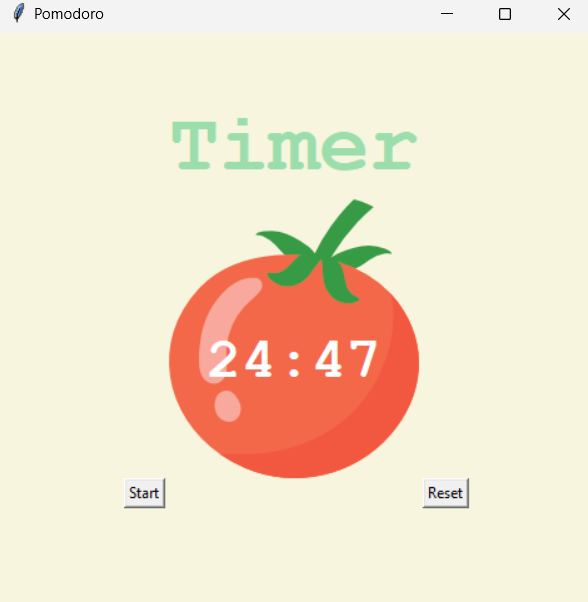

# ⏱️ Pomodoro Timer – Python Project (DAY 28)

A GUI-based **Pomodoro Timer** built using Python and Tkinter to help boost productivity. It uses the time management technique of working in focused intervals followed by short breaks.

---

## 📋 Table of Contents
- [Features](#features)
- [Technologies Used](#technologies-used)
- [How It Works](#how-it-works)
- [Getting Started](#getting-started)
- [Screenshots](#screenshots)
- [Enhancement Ideas](#enhancement-ideas)
- [Author](#author)
- [License](#license)

---

## ✅ Features

- 25-minute work sessions
- Short (5 min) and long (20 min) break cycles
- Visual timer with a circular countdown
- Checkmark tracker to count completed pomodoros
- Customizable UI elements with a clean layout

---

## 🛠 Technologies Used

- Python 3.x
- `tkinter` for GUI
- `time`, `math` for countdown logic

---

## ⚙️ How It Works

1. Click **Start** to begin the timer.
2. Work for 25 minutes (Pomodoro).
3. After each session:
   - Short break (5 min) if < 4 sessions completed
   - Long break (20 min) every 4th session
4. A checkmark (`✔`) appears for each session completed.

## OUTPUT:
   ```bash
## 📸 Screenshot




